# Prueba Técnica – Sistema de Tienda

## Descripción

Aplicación _Full Stack .NET (Angular 21 y .NET 8)_ para la gestión de una tienda, que permite administrar _artículos, tiendas, clientes_ y _compras_, incluyendo autenticación y un flujo básico de venta con carrito.

El objetivo de esta prueba es demostrar _criterio técnico, arquitectura y buenas prácticas_, priorizando funcionalidad y claridad sobre alcance completo.

---

## Stack Tecnológico

### Backend

- .NET 8
- Entity Framework Core 9.0.12
- SQL Server 2022
- Autenticación con JWT

### Frontend

- Angular 21
- Angular Material
- Tailwind CSS

---

## Tecnologias Implementadas

### Autenticación

- Login con JWT
- Protección de rutas mediante guards
- Interceptor para envío automático del token

### Backend

- CRUD de Artículos
- CRUD de Clientes
- CRUD de Compras
- Modelado relacional de base de datos code first
- Uso de DTOs para comunicación con el frontend
- Protección de endpoints con JWT
- Respuestas unificadas con wrapper
- Borrado lógico de entidades

### Frontend

- Login y registro de Clientes
- Protección de rutas con Guards
- Manejo de sesión con JTW
- Manejo de roles con Guards
- Formularios de creación/edición
- Carga de imagen desde el sistema del usuario con preview

---

## Funcionalidad de Login

- Inicio de sesión
<p>
  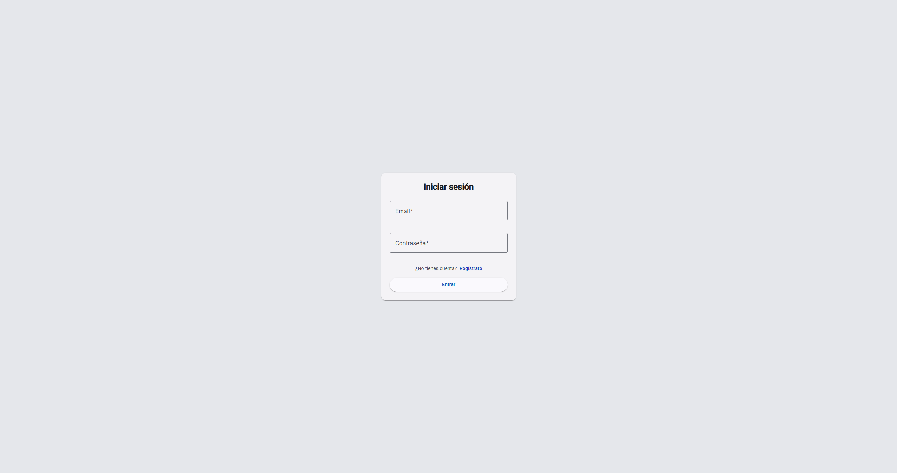
</p>

- Registro de clientes
<p>
  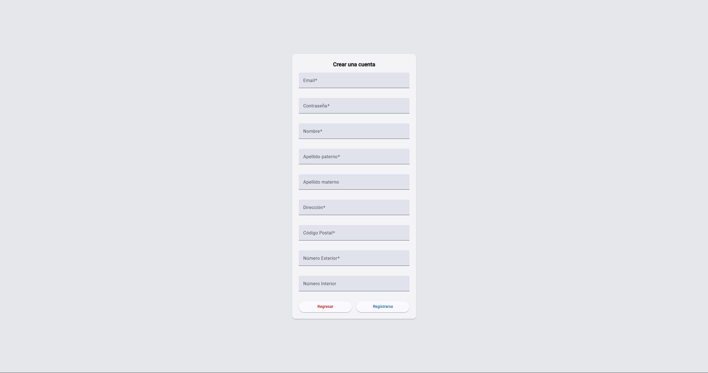
</p>

## Funcionalidad de Administración

Pantallas visibles unicamente para usuarios con rol de administración

```bash
CORREO: admin123@mail.com
CONTRASEÑA: admin123
```

- Registro de clientes
- Administración de Articulos
<p>
  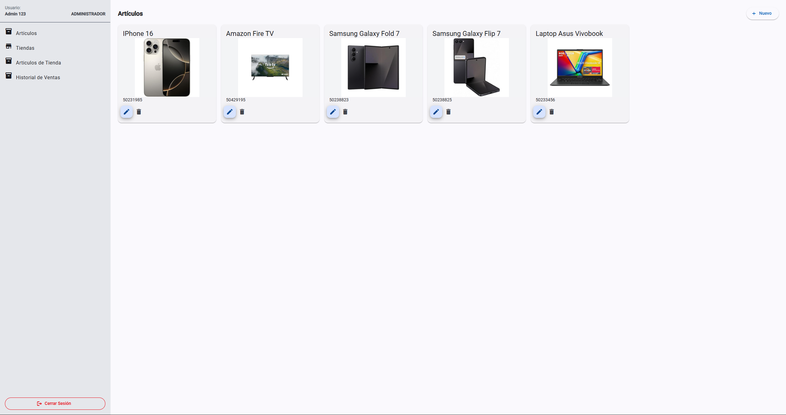
</p>
<p>
  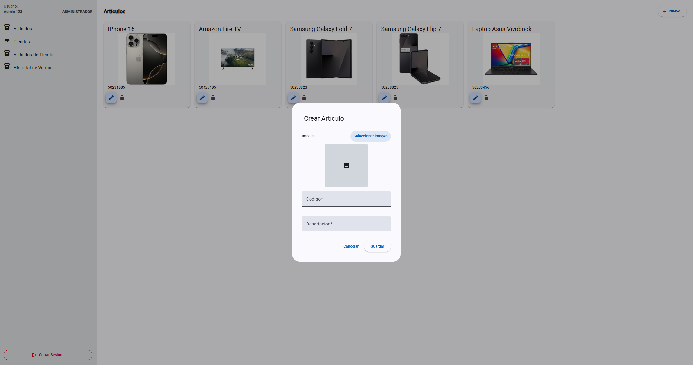
</p>
<p>
  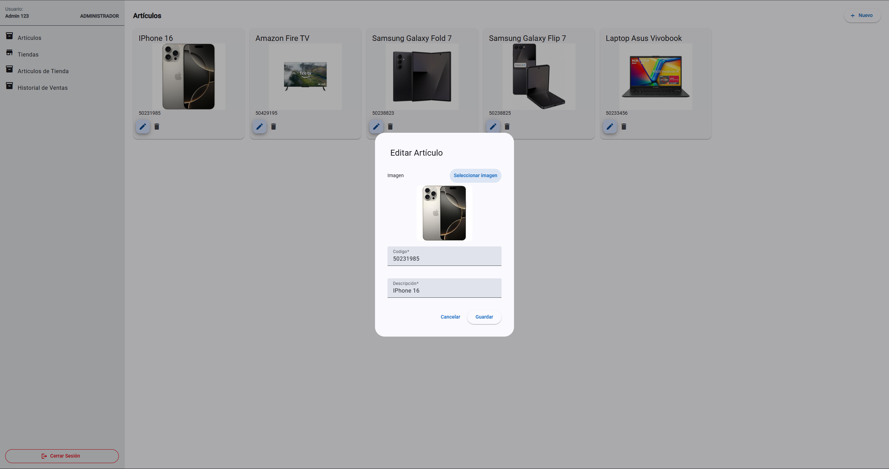
</p>

- Administración de Tiendas
<p>
  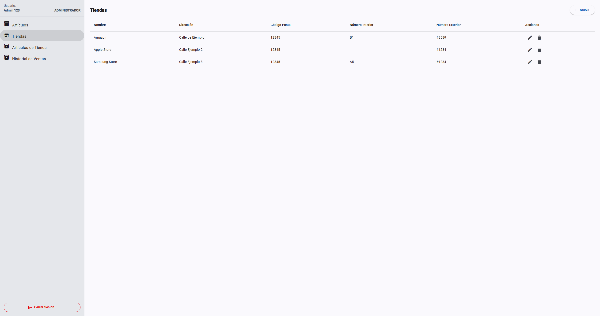
</p>
<p>
  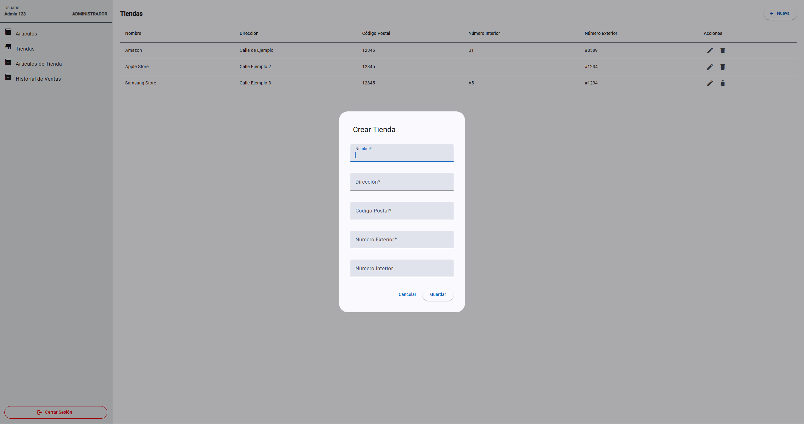
</p>
<p>
  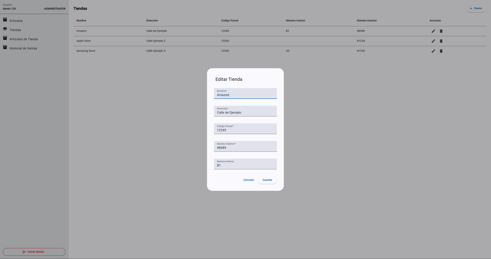
</p>

- Administración de Articulos vendidos por Tienda
<p>
  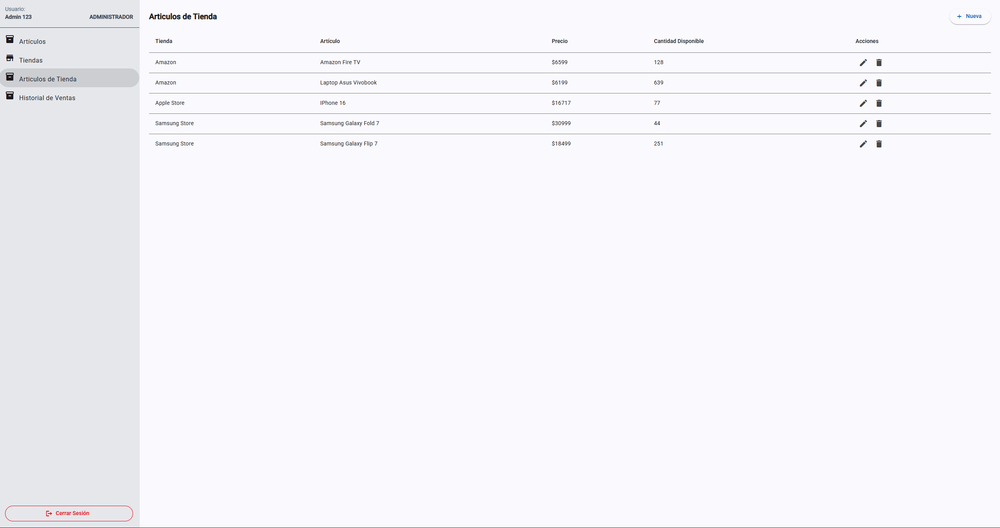
</p>
<p>
  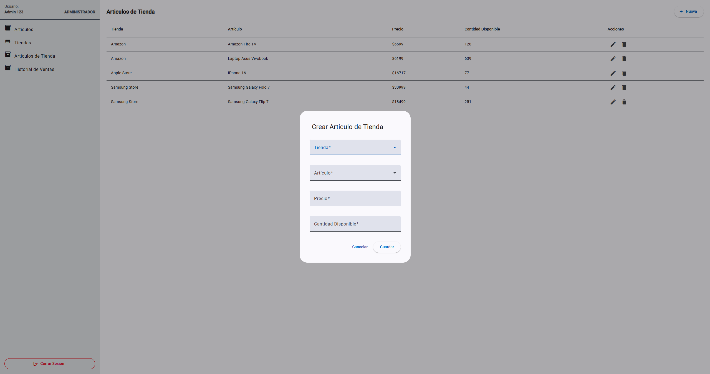
</p>
<p>
  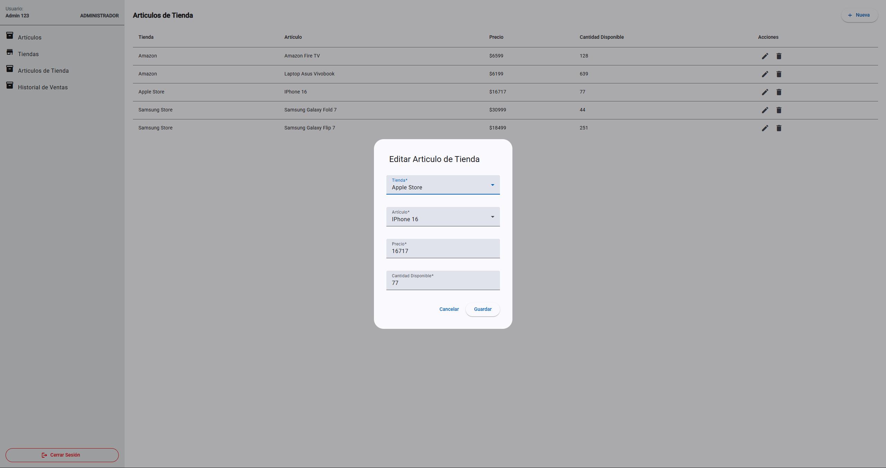
</p>

- Visualización de Ventas
<p>
  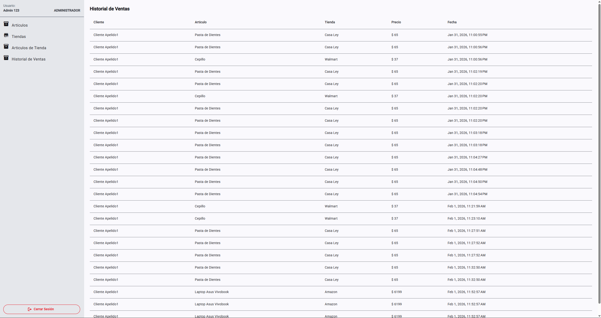
</p>

## Funcionalidad de Cliente

Pantallas visibles unicamente para usuarios con rol de Cliente

- Comprar Articulos de Tiendas
<p>
  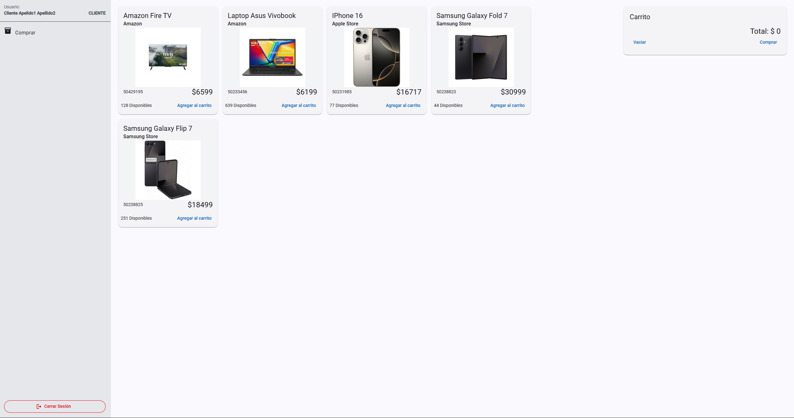
</p>

## Alcance y Decisiones Técnicas

Para esta prueba se priorizó:

- Arquitectura clara
- Código legible y mantenible
- Separación de responsabilidades
- Escalabilidad

Quedaron fuera por tiempo:

- Descuentos y ofertas sobre podructos
- Persistencia del carrito
- Paginación y filtros avanzados
- Tests automatizados
- Variables de entorno protegidas para credenciales
- Optimización avanzada de UI/UX
- Servicio de notificaciónes toast
- Servicio de envio de correos
- Métodos de pago

Estas mejoras se consideran para una siguiente iteración.

---

## Cómo ejecutar el proyecto

### Backend

1. Configurar la cadena de conexión a SQL Server
2. Recuperar informacion de la base de datos con el respaldo: _db.bak_
3. Ejecutar el proyecto

### Frontend

```bash
npm install
ng serve
```
